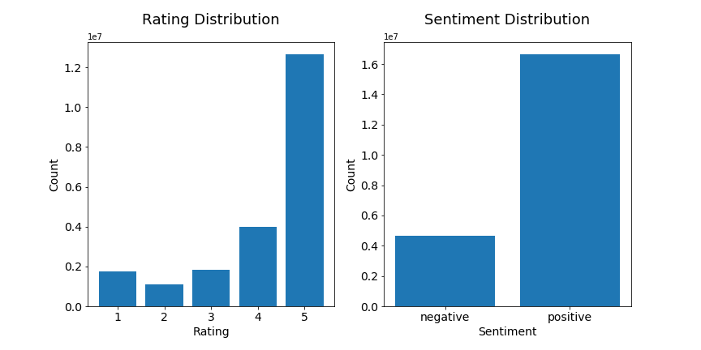
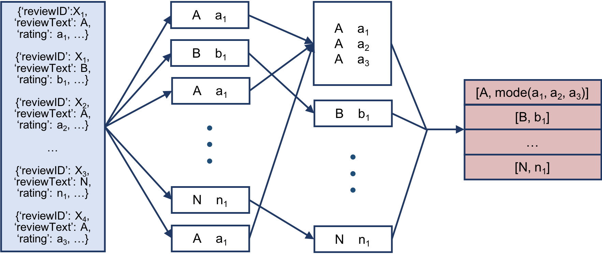

# Model Design

## Data and Preprocessing

### Serial Version

In this project, we use raw Amazon product review data from [1] and [2]. This public dataset consists of 142.8 million product reviews along with the corresponding ratings, reviewer IDs, product IDs, and other information, spanning from May 1996 to July 2014. It is suitable for our project because we can use the rating as an indicator of the sentiment in the review.

The first preprocessing step is to remove duplicates of text, in order to reduce unnecessary noises as well as to shrink data size. Because our project focuses on analyzing the sentiments within text, reviewer and product information is irrelevent. Thus, we remove duplicates only by the content of the review. Repeated text often have different ratings, and we only keep the one that appears the most. When there is a draw in frequency, we keep the smaller one with the attempt to balance the dataset, since we find that a majority of the reviews already have ratings of 5. After removing duplicates of text, we are left with 21.3 million distinct reviews.

The ratings have a range of 1 to 5, and the distribution is illustrated in the histogram below. We combine 1, 2, and 3 to indicate negative sentiment, and we combine 4 and 5 to indicate positive sentiment. The distribution after such grouping is also illustrated below.

Second, in order for RNN to process our data efficiently, we need to remove stopwords (words with little contribution to sentiment classification) and map the other meaningful words to numbers. The stopwords are inherited from the nltk package, and we add additional stopwords like 'product', 'would', and 'get'. The word-number dictionary are generated from our own dataset, in which only the most frequently appeared 10,000 words are kept. Words not included in this dictionary are mapped to a specific number indicating 'unknown'.

Lastly, the input to our RNN needs to have a fixed length, which we set to be 100. After the removal of stopwords, sequences that are too long are truncated, and sequences too short are padded. 

### Parallelization

The data preprocessing task is parallelized through MapReduce. The mapper reads in the raw data, removes special characters from the text, and outputs only the text and the ratings. The reducer reads in the output of the mapper, sorted first by the text, so that repeated text are together. It further processes the text (remove stopwords, map words to numbers, and truncate or pad to achieve ideal length). Furthermore, it calculates the mode of ratings for each distinct review text and maps it to 0 or 1 to indicate negative or positive sentiment. This sentiment indicator value is appended to the end of the text sequence, and the output is written as a numpy array in an h5 file.

Because our dataset is so large, we perform the MapReduce process on an AWS EMR cluster. The cluster reads data from an S3 bucket. In order to prevent overwriting the results, each worker node generates a separate h5 file and uploads it back to the S3 bucket, and the files are differentiated by including the host name of the node in the file name. We found that best performance is achieved through having eight m4.xlarge worker nodes in the cluster. 

We combine these intermediate h5 files into one single file on an m4.2xlarge EC2 instance so that it has larger memory to handle large arrays. In this final h5 file, data from each intermediate file is grouped in one dataset, and each entry of data (a pair of word sequence and sentiment indicator) is stored as a chunk.

## RNN Model

### Serial Version

Due to serial nature of customer reviews, we use Recurrent Neural Network to model the time dependency of words in each sentences and predict whether the review is positive or negative. We apply LSTM layers instead of regular recurrent neural network because it is more robust to vanishing or exploding gradient problems. We trained an embedding layer to reduce the dimensionality of word representation. Our codes are modified from Subramanian's book: *Deep Learning with Pytorch* RNN chapter. Hyperparameters such as number of layers and hidden dimensions are tuned on our dataset, with careful consideration for the tradeoff between model performance compuational time. 

Our dataset is highly imbalanced, with 12 million 5-rating review, accounting for 59% of the data. To overcome this imbalance, we experimented with multiple loss functions such as MSE(recoding response as continuous), crossEntropy and BCEWithLogitsLoss. We chose loss function to be BCEWithLogitsLoss because it is both numerically stable and has the flexibility to incorporate class weights. We also transformed the reviews to be binary(with 1-3 as negative and 4-5 to be positive) to combat the imbalance problem. The dataset class breakdown before and after this change is reported in details in our data section.

### Parallelization

