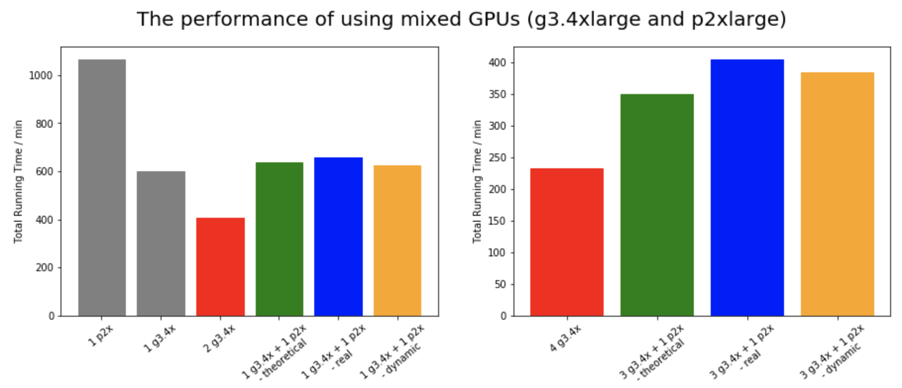

## Experiments and Performance Results

Click <a href="http://sophieyanzhao.github.io">here</a> to go back to Homepage.

## Table of Contents
1. [Metrics of Performance](#i-metrics-of-performance)
2. [Data Preprocessing](#ii-data-preprocessing)
  * [Overhead and Mitigation Methods](#overhead-and-mitigation-methods)
  * [Performance Analysis](#performance-analysis)
3. [Running SGD with RNN for Sentiment Analysis](#iii-rnn-sgd)
  * [Code Baseline](#code-baseline)
  * [Experiment with different number of GPUs](#experiment-with-different-number-of-GPUs)
  * [Experiment with different distributions of GPUs per node for a total fixed number of GPUs](#experiment-with-different-distributions-of-GPUs-per-node-for-a-total-fixed-number-of-GPUs)
  * [Experiment with different problem size](#experiment-with-different-problem-size)
  * [Experiment with mixed of GPUs using dynamic load balancer](#experiment-with-mixed-of-GPUs-using-dynamic-load-balancer)
  

### I. Metrics of Performance

While measuring the performance in terms of parallelization, we focus on the following metric:

  * **Throughput**: Throughput is defined as the ratio of problem size to the running time. 
  
  * **Speedup**: In general, speedup is a number that measures the relative performance of two systems processing the same problem. Specifically, if the amount of time to complete a work unit with 1 processing element is t1, and the amount of time to complete the same unit of work with N processing elements is tN, the strong scaling speedup is t1/tn. Also, under the weal scaling setting, t1 and tn are both measured with different total problem size (same size for every node), i.e., t1 will change with the number of processor, Then the weak scaling speedup is calculated correspondingly. Note the definition of weak scaling speedup is usually obscure, here we use this definition.
  
  * **Efficiency**: Efficiency refers to the ratio of the speedup to the number of processors, which is ideally constant. 

### II. Data Preprocessing

#### Overhead and Mitigation Methods

The main overhead comes from sequential code. First, to remove stopwords, we need to compare each word in the sequence with intended stopwords to determine whether we remove this word from the sequence. We save the stopwords in a set instead of a list to shorten the runtime from O(N) to O(1). Moreover, when we combine the h5 files, it takes a long time to write data to h5 files, especially when we save as many different datasets within the h5 file. Ideally, we would want to save all data in one single h5 dataset. However, we need to save data in a single array before saving it as a dataset, and we are restricted by the memory size of the instance. Therefore, we decide to save data into eight separate datasets with equal size. For faster reading during the training process, the datasets in the h5 file are chunked, so that when the data loader accesses a single entry, it does not need to load any other data into the memory.

A second source of overhead is communication. To avoid overwriting, each node in the EMR cluster writes its own h5 file and uploads to the S3 bucket. This time is reduced by having multiple nodes process the data and each upload a section of processed data at the same time.

#### Performance Analysis

The runtime with different problem sizes and numbers of processors is listed below:

| Percentage of Full Dataset | Runtime with 2 Nodes Cluster | Runtime with 4 Nodes Cluster | Runtime with 8 Nodes Cluster |
|----------------------------|------------------------------|------------------------------|------------------------------|
| 25%   | 99 min | 28 min  | 14 min  |
| 50%   | Failed | 51 min  | 30 min  |
| 100%  | Failed | Failed  | 55 min  |

We simply were not able to process more than 1/8 of the data on one single node because the worker nodes get unstable. Even when we tried to process 1/4 of the data on a two nodes cluster, the runtime is abnormally long. Therefore, we are not able to calculate metrics like speedup under week scheduling setting, and speedup under strong scheduling setting is calculated against runtime on two nodes.

Under Strong scheduling setting, the metrics with fixed problem size (25% of the data) are calculated as follows:

Under the idea of weak scheduling, the runtime with fixed problem size per node is illustrated below:

We observe roughly linear speedup and throughput with fixed problem size. We suspect that the runtime for 25% data on two node cluster is abnormal, so the relationship should be more linear, and the efficiency should be similar. Moreover, the runtime for fixed problem size per processor should be similar, as well.

<<<<<<< HEAD
### III. Running SGD with RNN for Sentiment Analysis
=======
### II. Running SGD with RNN for Sentiment Analysis

Since AWS does not approve our request of 8 g3.4xlarge instances, we can only use 4 g3.4xlarge instances (each with 1 GPU) and 2 g3.16xlarger instance (each with 4 GPUs). Along with limited credits, our experiment results would be a little bit biased and limited due to different memory, network, I/O and configurations, etc.

>>>>>>> b44301ef9cf8644bae9f7dbd95a90d47057c7148
#### Code Baseline

We run sequential RNN on 1 g3.4xlarge instance, which would be our code baseline. Results are shown below:

|epoch|time(s)|test acc| test f1|
|-----|-------|--------|--------|
|1    |3840   |81.41%  |0.85    |
|2    |3542   |83.48%  |0.86    |
|3    |3572   |83.59%  |0.86    |
|4    |3570   |83.73%  |0.86    |
|5    |3605   |84.36%  |0.86    |
|6    |3534   |84.29%  |0.86    |
|7    |3564   |84.22%  |0.86    |
|8    |3564   |84.76%  |0.86    |
|9    |3544   |84.43%  |0.86    |
|10   |3573   |84.96%  |0.86    |

*Total training time: 9.98 hours*

Also, we profile this code, whose profiling results are shown below:

From this profiling result of a single g3.4xlarge instance, we see that this is mainly a GPU intensive task where tasks such as, backward and forward propagations, take up to 50% of the entire run time. This is also somewhat CPU intensive in that data loading takes about 10% of the runtime. Therefore, we should mainly focusing on parallelizing the GPU aspect and its overhead while reducing the data loading process through multi-core parallelization whenever possible.

#### Experiment with different number of GPUs

In order to see whether our model is *strongly scalable*, we run our model on the whole dataset with different number of GPUs. Specifically, we tried 1 GPU (1 g3.4xlarge instances), 2 GPUs (2 g3.4xlarge instances), 4 GPUs (4 g3.4xlarge instances) and 8 GPUs (2 g3.16xlarge instances). The results are shown in the following figure:

Consistent with Facebook's paper, we can see the linear throughput and log-linear speed-up. However, the efficiency decreases as the number of GPUs increases, which indicates our model is not strongly scalable. Further, here we calculate the speedup and efficiency in terms of two "time" - real execution time for 10 epochs and convergence time when loss is below *0.13*. These two measurments of time both have practical meaning since we are concern with how long each epoch takes and how long the covergence requires. We find that the speedup and efficiency is calculated based on the convergence time is lower, which is reasonable since data parallelism can slow up convergence. 

Also, we investigate into the convergence of our RNN with different number of GPUs. In terms of the number of epochs and execution time, we set the loss value *0.13* as the convergence threshold, and obtain the results as follow:

The results exactly match our intution: 

  * The principle of parallel SGD and its convergence is based on *Gradient Aggregation*. Basically, the aggregated gradient is used to approximate the true gradient, and when the number of epochs increases, this approxmation becoomes precise. Also, from the left plot, in terms of the number of epochs, we can see that 1-node version has highest rate of convergence, and 8-node version has lowes rate of convergence.

  * While the number of GPUs increasing, each GPU will handle a smaller part of data, which means the time of each epoch decreases. Also, the advantage of *Gradient Aggregation* is that the approxmation of gradient can be attained more quickly. From the right plot, in terms of the running time, the model with more GPUs converges faster, which sugeests the convergence is accelerated by data parallelism.
  
#### Experiment with different distributions of GPUs per node for a fixed total number of GPUs

We also experiment our model when the total number of GPUs is fixed. Specifically, with total 4 GPUs, we ran our model on 1 node with 4 GPUs (1 g3.16xlarge instance), 2 nodes with 2 GPUs (2 g3.16xlarge instance, each only use 2 GPUs) and 4 nodes with 1 GPUs (1 g3.16xlarge instance). The results are shown in this table:

| # of Node | # of GPUs | Time (min/epoch) | Speed-up |
|-----------|-----------|------------------|----------|
| 1         | 4         | 21.9             | 2.73     |
| 2         | 2         | 26.4             | 2.27     |
| 4         | 1         | 23.3             | 2.57     |

We can see that 1-node-4-GPU version has best speedup and 2-node-2-GPU version gives the worst speedup. Also, we assess each model's covergence, which are shown in the following plot:

This plot shows that these three version has same convergence rate, except that the loss 4-node-1-GPU version decreases slowly at first. Perhaps it is becuase the communication overhead, but also can be the stochasticity introduced by SGD.

#### Experiment with different problem size

In order to show weak scaling speedup and efficiency, we randomly sample 25%, 50%, and 100% data and run our RNN model on them with 1 GPU (1 g3.4xlarge instances), 2 GPUs (2 g3.4xlarge instances), 4 GPUs (4 g3.4xlarge instances). The result plots are shown below:

As we can see, the similar results with strong scaling are obtained under weak scaling setting. Thus, our model are also not weakly scalable.

#### Experiment with mixed of GPUs using dynamic load balancer

As we mentioned in *Model Section* and demonstrated in the bar plot below, our dynamic load balancer has shown the success while using mixed GPUs (p2xlarger and g3.4xlarger). 

